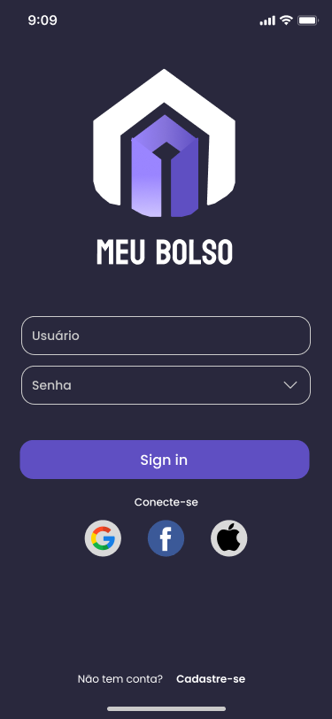
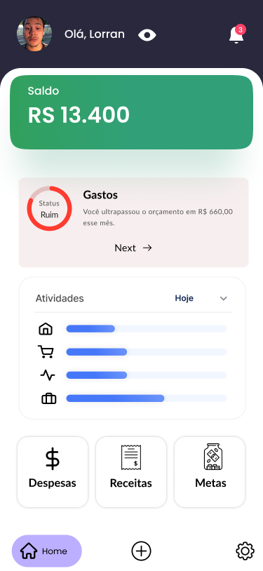
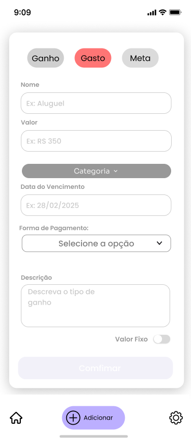
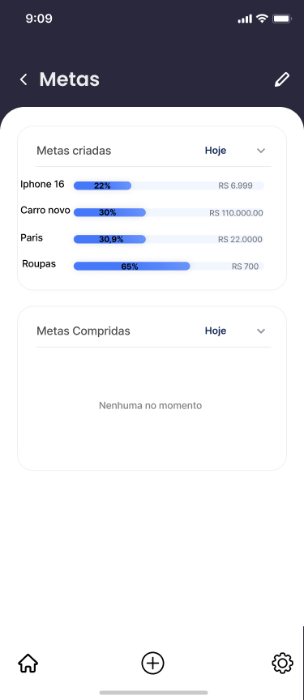
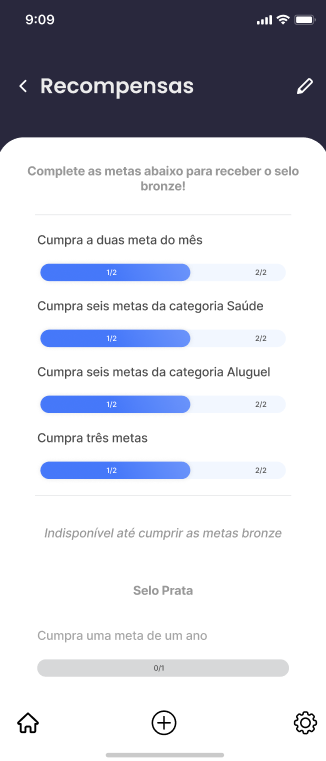
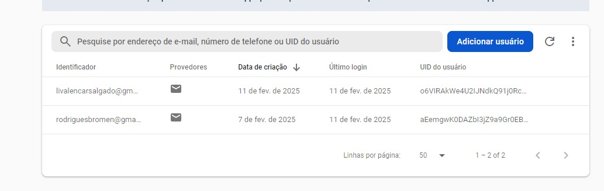
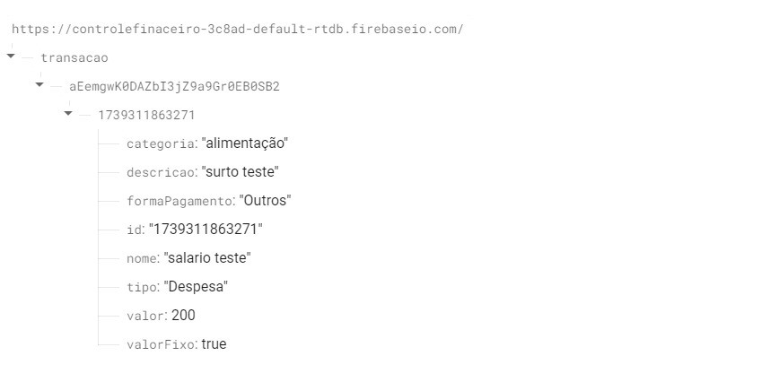

# Meu Bolso

O **Meu Bolso** (MB) é uma solução desenvolvida em Java para ajudar no controle financeiro pessoal. Com o objetivo de promover hábitos saudáveis de economia e gestão financeira, o MB oferece um sistema completo de registro e acompanhamento de receitas e despesas, além de um sistema de metas e recompensas gamificadas. A aplicação foi construída com foco em usabilidade e clareza, facilitando o planejamento financeiro do usuário.


### Sobre o projeto

Projeto desenvolvido para a disciplina de Programação Orientada a Objetos (POO) do curso de **Bacharelado em Ciência da Computação** do **IFCE campus Maracanaú**, ministrada pelo professor Igor Valente, durante o semestre 2024.2.
## Tecnologias Utilizadas

- **Linguagem:** Java
- **Frameworks e Bibliotecas:** Android SDK, Firebase (para autenticação e armazenamento de dados)
- **Banco de Dados:** Firebase Realtime Database
- **Gerenciamento de Dependências:** Gradle (build.gradle.kts)

### Versões das Ferramentas Utilizadas

- **Android Studio:** Ladybug Feature Drop 2024.2.2  
  Build: AI-242.23726.103.2422.12816248
- **Java Runtime:** OpenJDK 21.0.4
- **Android SDK (compileSdk):** 35
- **Google Services Plugin:** 4.4.2
- **Gradle:** 8.10.2
- **Firebase BoM:** 33.8.0
- **Firebase Firestore:** Versão gerenciada pelo BoM
- **Firebase Authentication:** Versão gerenciada pelo BoM
- **Firebase Realtime Database:** 20.0.5
## Funcionalidades

#### Cadastro e Login:
- Criação de conta com informações pessoais (nome, e-mail e senha);
- Acesso via e-mail ou usuário definido;
- Recuperação de senha em caso de esquecimento.

#### Registro de Transações:
- Registro de despesas e receitas com categoria, valor, data e descrição;
- Edição e exclusão de transações registradas;
- Filtragem das transações por período e categoria.

#### Visão Geral das Finanças:
- Exibição de resumo financeiro com saldo atual, total de receitas e despesas;
- Elementos visuais para facilitar a análise do desempenho financeiro.

#### Sistema de Metas e Recompensas:
- Estabelecimento de metas de economia para semanas, meses ou anos;
- Acompanhamento do progresso da meta e informações sobre quanto falta para alcançá-la;
- Recompensas virtuais ao atingir uma meta, que são exibidas na seção de conquistas.

## Screenshots

<p align="center">
    
    
    
</p>

<p align="center">
    
    
    

</p>

## Funcionamento do banco de dados

O aplicativo Meu Bolso utiliza o Firebase Authentication para gerenciamento de usuários e o Firebase Realtime Database para armazenar e gerenciar transações financeiras dos usuários.

### Autenticação
Cada usuário registrado recebe um UID único, que é utilizado como chave primária no banco. A tela do Firebase Authentication abaixo mostra uma lista de usuários cadastrados no sistema, com informações como e-mail, provedor de login, data de criação e UID.

  

### Campos das transações:
**categoria**: Define a categoria do gasto (Ex: "Alimentação", "Transporte").

**descricao**: Texto descritivo da transação.

**formaPagamento**: Método de pagamento utilizado (Ex: "Cartão de crédito", "Dinheiro").

**id**: Identificador único da transação.

**nome**: Nome da transação.

**tipo**: Define o tipo de transação.

**valor**: O valor da transação em reais.

**valorFixo**: Indica se é uma transação recorrente (true/false).

```json
{
  "transacao": {
    "{UID do usuário}": {
      "{ID da transação}": {
        "categoria": "Alimentação",
        "descricao": "Compra referente a primeira quinzena do mês",
        "formaPagamento": "Outros",
        "id": "1739311863272",
        "nome": "Supermercado",
        "tipo": "Despesa",
        "valor": 200,
        "valorFixo": true
      }
    }
  }
}
```

### Armazenamento de transações
Todas as transações são salvas dentro do nó transacao/{UID}, garantindo que cada usuário acesse apenas seus próprios dados.

  

</br>

## Como rodar o projeto

#### Requisitos
- Android Studio instalado (versão mais recente recomendada);
- Conta no Firebase para configurar os serviços de autenticação e banco de dados;
- Emulador Android ou dispositivo físico para testes.

#### Passos de instalação
1. Clone o repositório:
```bash
  git clone https://github.com/LorranBezerra/MeuBolso-PJ-Final.git
```
2. Importe o projeto no Android Studio

3. Configure o Firebase adicionando o arquivo google-services.json na pasta app.

4. Sincronize as dependências do Gradle.

5. Execute o projeto em um emulador ou dispositivo físico.
## Autores

- [@LorranBezerra](https://github.com/LorranBezerra)
- [@LivSalgado](https://github.com/LivSalgado)
- [@LHneto](https://github.com/LHneto)
- [@n1nick](https://github.com/n1nick)

## Licença
Este projeto está licenciado sob a licença 
[MIT](https://choosealicense.com/licenses/mit/) - acesse o link  para mais informações.